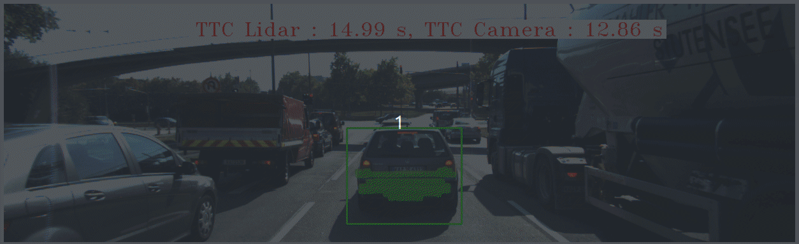

# 3D Object Tracking

### (based on [Sensor Fusion Nanodegree Program](https://www.udacity.com/course/sensor-fusion-engineer-nanodegree--nd313))


Current application calculates time to collision (TTC) based on the LiDAR and camera data. It's based on the other [2D feature tracking project](https://github.com/cr0mwell/2D_feature_tracking).
Here some more advanced features were implemented:
* Added object detection using [YOLOv3](https://docs.ultralytics.com/models/yolov3) model.
* LiDAR points clustering by the ROI of the obstacle bounding boxes (BBs);
* "bird view" visualization of the LiDAR point cloud;
* Obstacle BB matching, using 2D feature tracking;
* TTC calculation using LiDAR data;
* TTC calculation using camera data;
* Visualization of the results;

## Environment prerequisites
1. Ubuntu 22.04
2. C++ standard v14
3. gcc >= 11.4
4. cmake >= 3.22
5. make >= 4.3
6. OpenCV >= 4.9
* NOTE: this must be compiled from source using the `-D OPENCV_EXTRA_MODULES_PATH=<opencv_contrib>modules` and `-D OPENCV_ENABLE_NONFREE=ON` cmake flags for testing the SIFT and SURF detectors/descriptors. Refer to the [official installation instructions](https://docs.opencv.org/master/df/d65/tutorial_table_of_content_introduction.html).

## Basic Build Instructions
1. Clone this repo
    ```shell
   cd ~
   git clone https://github.com/cr0mwell/3D_object_tracking.git
   ```
2. Download YOLOv3 weights file [yolov3.weights](https://pjreddie.com/media/files/yolov3.weights):
   ```shell
   cd 3D_object_tracking/dat/yolo
   wget https://pjreddie.com/media/files/yolov3.weights
   cd ../..
   ```
3. Make a build directory in the top level directory: `mkdir build && cd build`
4. Compile: `cmake .. && make`
5. Run it: `./3D_object_tracking`.
